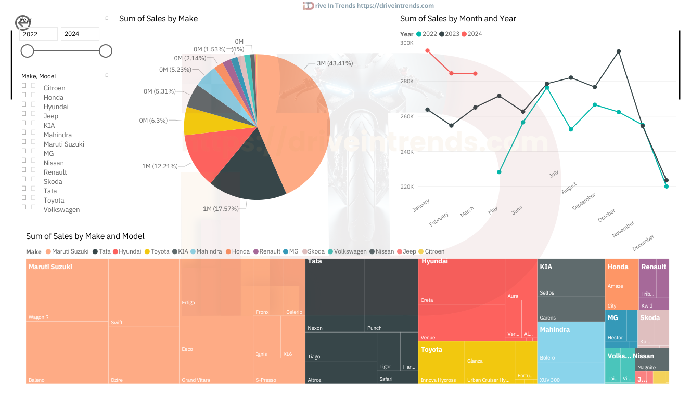

# 🚗 Sales Data Analysis & Visualization

  

## 🎨 About the Project

This repository contains a Jupyter Notebook for analyzing raw sales data and visualizing it through a well-structured dashboard. The project focuses on organizing raw data using pandas and creating meaningful insights through a Power BI dashboard.

---

## 🚀 Features

- 📊 Transform raw sales data into a structured format.
- 🧹 Clean data by parsing and handling missing values.
- 🔄 Transpose and restructure data for easy analysis.
- 📈 Generate insightful visualizations for sales trends.
- 🌐 Explore more insights at [Drive In Trends](https://driveintrends.com).

---

### Visualization Dashboard



This visualization is developed using Power BI. It includes:
- Slicers for filters (slider and dropdowns).
- Line chart for monthly sales figures by year.
- Pie chart for total sales by make (Maruti Suzuki is the winner!).
- Treemap showing detailed sales by model and year.

---

## 🛠️ Procedure

### 1. Parse the Sales Column

```python
import pandas as pd
import ast

df = pd.read_csv('sales_raw.csv', sep='|')
df['sales'] = df['sales'].apply(lambda x: ast.literal_eval(x))
```
- **Key Notes:**
  - Used `ast.literal_eval` to convert the sales column from string to dictionary.

### 2. Expand the Sales Data

```python
df = pd.concat([df, df['sales'].apply(pd.Series)], axis=1)
df.drop(columns=['sales'], inplace=True)
```
- **Key Notes:**
  - `pd.Series` expands each dictionary into separate columns for each Month-Year.

### 3. Clean the Data

```python
df.dropna(subset=df.columns.drop(['make', 'model']), inplace=True)
```
- **Key Notes:**
  - Dropped rows with missing sales values while retaining make and model.

### 4. Reshape the Data

```python
df = df.melt(id_vars=['make', 'model'], var_name='date', value_name='sales')
df['month'] = df['date'].apply(lambda x: x.split(' ')[0])
df['year'] = df['date'].apply(lambda x: '20' + x.split(' ')[1])
df = df[['make', 'model', 'date', 'month', 'year', 'sales']]
df.to_csv('sales.csv', index=False)
```
- **Key Notes:**
  - Used `melt` to transpose Month-Year columns into two columns: `date` and `sales`.
  - Extracted `month` and `year` from the `date` column.

---

## 📂 Folder Structure

```
project-name/
├── sales_raw.csv        # Raw sales data
├── sales.ipynb          # Jupyter Notebook with the procedure
├── sales.csv            # Processed sales data
├── viz_dash_1.png       # Visualization dashboard image
├── media/               # Folder for static assets (e.g., images, GIFs)
└── README.md            # This file
```

---

## 📚 Usage

### Requirements

Install the required packages listed in `requirements.txt`. Key dependencies include:
- pandas
- ast
- ipykernel (for running Jupyter Notebooks in VS Code)

### Run the Notebook

1. Clone the repository:
   ```bash
   git clone https://github.com/CoderLaz/fourwheeler_sales_analysis.git
   ```
2. Navigate to the project directory and launch Jupyter Notebook:
   ```bash
   cd fourwheeler_sales_analysis
   jupyter notebook
   ```
3. Open the notebook and execute the cells to preprocess the data and export the cleaned dataset.

---

## 🌟 Future Scope

- Enhanced dashboards with KPIs and top-performing makes/models.
- "Car of the Year" analysis based on sales and specifications.
- Integration of vehicle specifications with sales data for detailed insights.

---

## 🤝 Contributing

Contributions are welcome! Please follow these steps:

1. Fork the repository.
2. Create a new branch (`git checkout -b feature-branch`).
3. Make your changes and commit them (`git commit -m 'Add feature'`).
4. Push to the branch (`git push origin feature-branch`).
5. Create a Pull Request.

---

## 📝 License

This project is licensed under the MIT License. See the [LICENSE](LICENSE) file for details.

---

## 📬 Contact

- **Website:** [Drive In Trends](https://driveintrends.com)
- **Email:** lazarusbenjamin2001@gmail.com

---

Made with ❤️ by [Your Name](https://github.com/CoderLaz).

